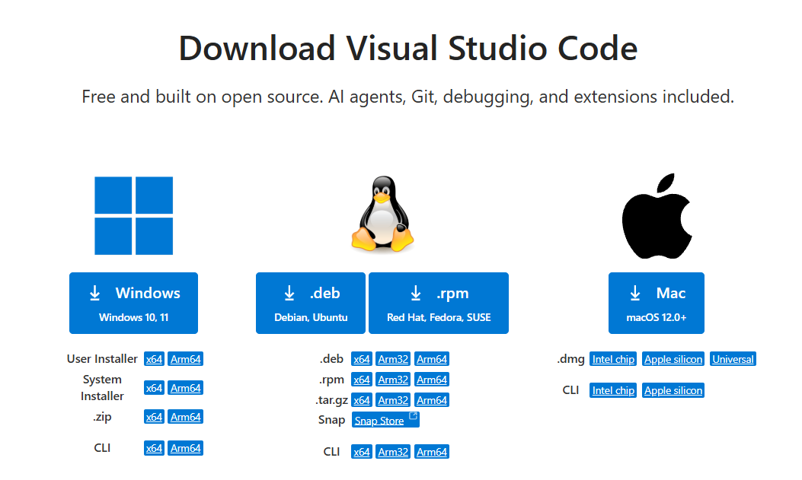
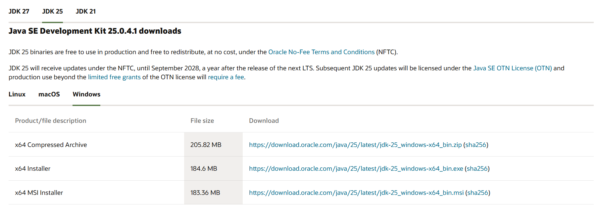
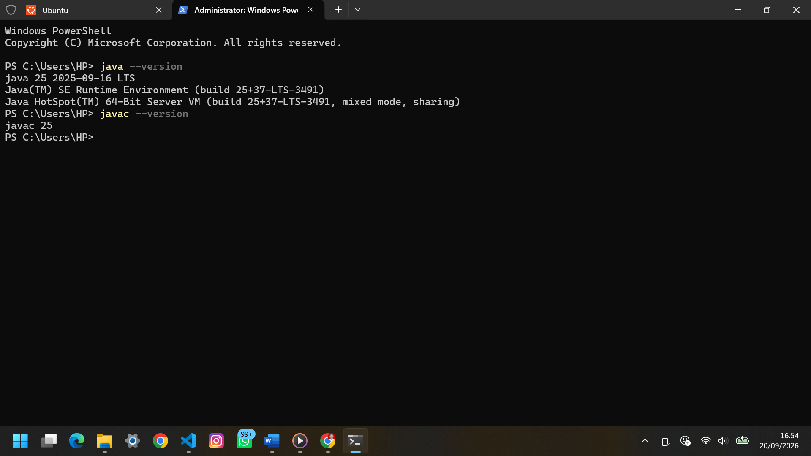
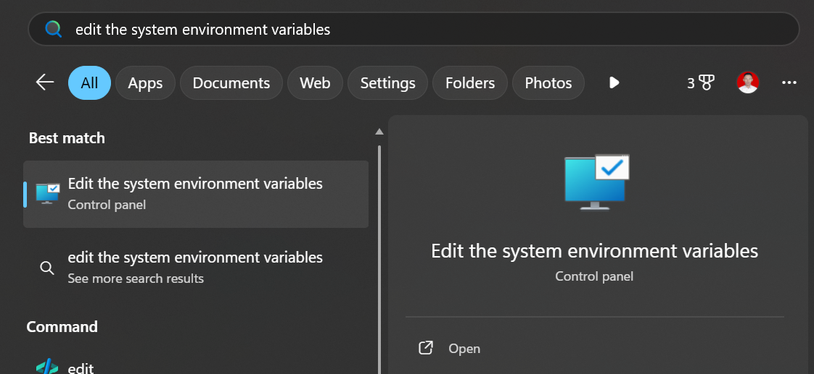
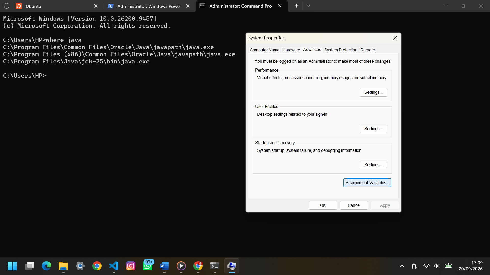
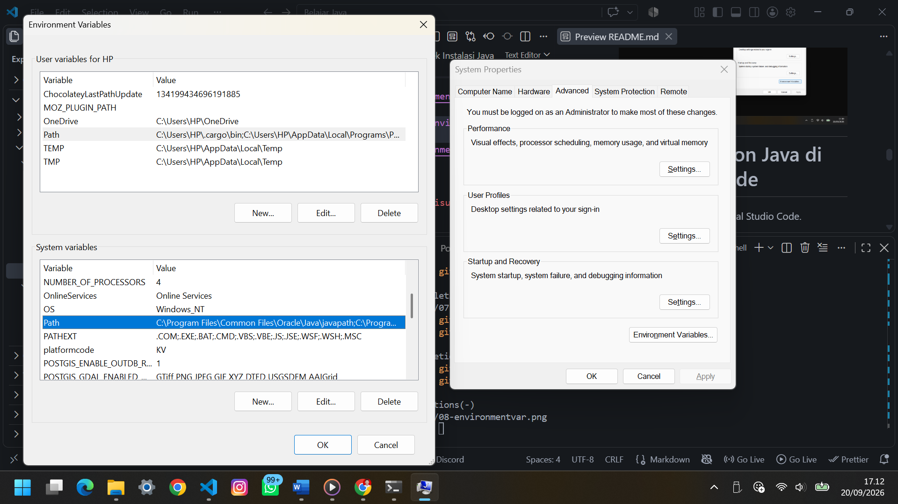
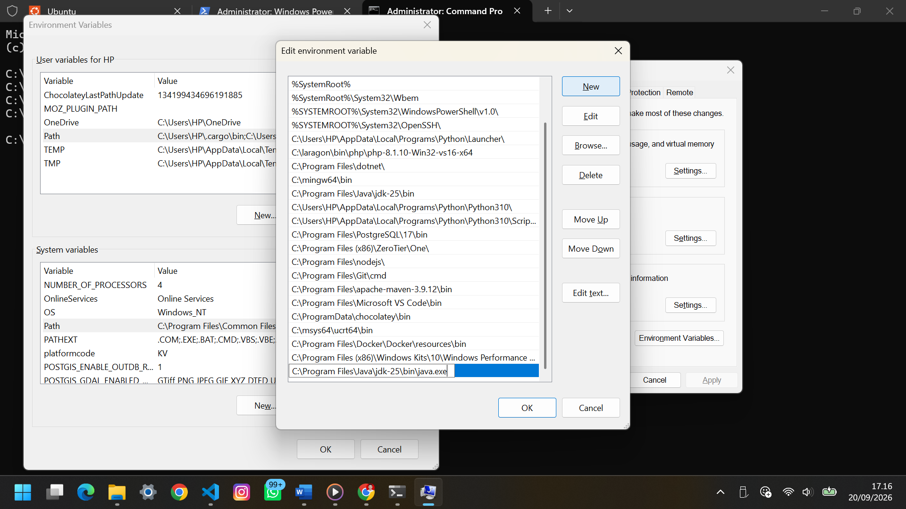
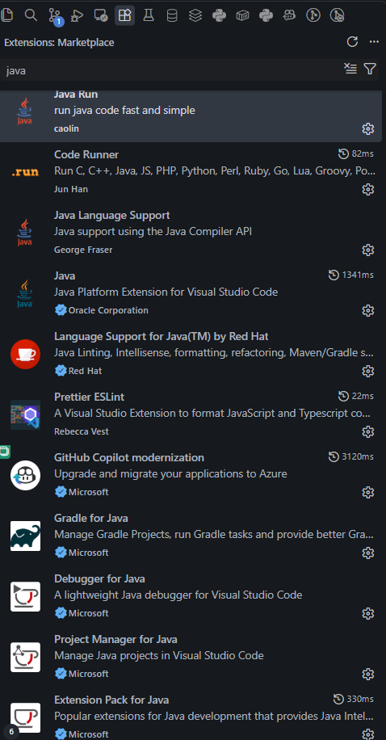

# 🛠️ Instalasi Java Development Environment

Link Panduan dalam bentuk Video:
https://youtu.be/m7orYxDyt24

Panduan ini digunakan untuk menyiapkan environment yang diperlukan untuk mengikuti pembelajaran Java pada repository ini.

Development environment yang digunakan:

- **Visual Studio Code** sebagai code editor.
- **JDK 25** sebagai Java Development Kit.
- **Java Extension Pack** untuk membantu proses pengembangan Java di Visual Studio Code.

---

# 1. Install Visual Studio Code

Download Visual Studio Code melalui website resmi:

🔗 https://code.visualstudio.com/download?_exp_download=fb315fc982

Pilih installer sesuai sistem operasi yang digunakan.

Untuk Windows, pilih installer Windows kemudian tunggu proses download selesai.
Pilih yang versi System Installer (x64)

---

## Instalasi Visual Studio Code

1. Jalankan file installer Visual Studio Code.
2. Ikuti proses instalasi.
3. Gunakan pengaturan default jika tidak memiliki kebutuhan khusus.
4. Setelah instalasi selesai, buka Visual Studio Code.

Screenshot:



---

# 2. Install JDK 25

JDK diperlukan untuk melakukan compile dan menjalankan program Java.

Download **JDK 25 untuk Windows 64-bit** melalui link berikut:

🔗 https://download.oracle.com/java/25/latest/jdk-25_windows-x64_bin.exe

Setelah download selesai:

1. Jalankan installer JDK.
2. Ikuti proses instalasi.
3. Gunakan lokasi instalasi default.
4. Tunggu hingga proses instalasi selesai.

Screenshot:



---

# 3. Mengecek Instalasi Java

Setelah JDK selesai di-install, buka terminal.

Di Visual Studio Code, terminal dapat dibuka melalui:

```text
Terminal → New Terminal
```

Kemudian jalankan:

```bash
java --version
```

Jika Java sudah berhasil terpasang, terminal akan menampilkan versi Java yang digunakan.

Contoh:

```text
java 25 2025-09-16 LTS
```

Kemudian cek compiler Java:

```bash
javac --version
```

Contoh:

```text
javac 25
```

Screenshot:



Lalu ketika sudah terlihat versinya, kita masukkan Path lokasi java ke System Properties Laptop/PC

Tahapan:

1. Klik Windows, ketik:
```text
edit the system environment variables
```


2. Lalu klik open, dan klik ***Environment Variabel***


3. Terlihat pada Environment Variabel ada ***User Variabel*** (atas) dan ***System Variabel*** (bawah).


4. Klik **Path** di kedua variabel tersebut, lalu klik **Edit** masukkan lokasi Java yang sudah kamu download tadi


5. Ketika sudah dimasukkan, klik **Oke** sampai menu Environtment tertutup. Lalu Reload Windows dan Reload Visual Studio Code kamu


---

# 4. Install Extension Java di Visual Studio Code

Buka menu **Extensions** pada Visual Studio Code.

Cari:

```text
1. Code Runner
2. Java
3. Java Run
4. Language Support for Java(TM) by Red Hat
5. Debugger for Java
6. Test Runner for Java
7. Extension Pack for Java
8. Error Lens
9. CodeSnap
```

Opsional biar Gantengg:

```text
10. Material Icon Theme
11. One Dark Pro
12. WSL
```

Kemudian install extension-extension tersebut.

Catatan:
**Extension Pack for Java** membantu menyediakan berbagai fitur yang dibutuhkan untuk pengembangan Java di Visual Studio Code. Sebenarnya dengan memasang satu Extention ini sudah cukup buat memulai Java, ku tambahkan yang lain agar lebih mempermudah saja

Screenshot:



---

# 5. Membuat Program Java Pertama

Buat file:

```text
Main.java
```

Kemudian masukkan kode berikut:

```java
public class Main {

    public static void main(String[] args) {

        System.out.println("Hello, Java!");

    }
}
```

Simpan file tersebut.

---

# 6. Menjalankan Program

Buka terminal pada folder tempat file `Main.java` berada.

Compile program:

```bash
javac Main.java
```

Jika tidak terdapat error, jalankan program:

```bash
java Main
```

Output:

```text
Hello, Java!
```

Atau bisa juga klik **icon Play** di sudut kanan VS Code, dan pilih **Run Java**

---

# 7. Struktur Environment

Jika seluruh instalasi berhasil, environment yang digunakan adalah:

```text
Visual Studio Code
        │
        ├── Java Extension Pack
        │
        └── JDK 25
              │
              ├── javac
              └── java
```

Dengan environment tersebut, kita sudah siap mengikuti pembelajaran Java dan Pemrograman Berorientasi Objek.

---

## 📌 Catatan

Repository ini menggunakan **Visual Studio Code** sebagai code editor.

Materi perkuliahan dapat menggunakan IDE yang berbeda, tetapi contoh dan panduan pada repository ini disesuaikan agar dapat dipraktikkan menggunakan Visual Studio Code.